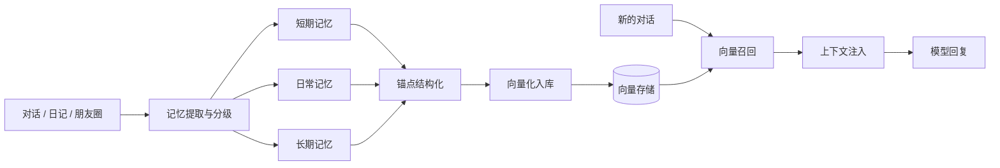

# 🏥 罗德岛通讯端 (Rhodes Terminal)

> 一款以 AI 角色互动为核心的开源 Android 聊天应用 —— 角色陪伴 · 长期记忆 · 群像叙事 · 世界观创作

<!-- 📸 截图位置①（顶部横幅，建议聊天主界面竖版截图，宽度约 800px）：
 -->

罗德岛通讯端是一个面向普通用户的 AI 角色聊天软件：为角色设定性格与背景后，即可与其进行长期聊天；也可以创建群聊展开群像互动、用 Galgame 制作互动剧情、通过知识库为角色挂载世界观资料，并将角色卡与聊天记录随时导出、跨设备迁移。

> **重要说明**：AI 的回复来自用户自行配置的第三方模型服务（不同模型的表达、速度、稳定性与收费方式不同）。本应用负责角色、记忆、聊天与设置的管理，**不内置任何模型**。

## ✨ 功能特性

- 💬 **私聊 & 群聊**：单角色深度陪伴与多角色群像互动
  <!-- 📸 截图位置②a： -->
- 🧠 **多层记忆系统**：短期 / 日常 / 长期三层记忆，配合向量检索，让角色"记得"久远经历
  <!-- 📸 截图位置②b： -->
- 📚 **知识库 / 世界书**：为角色挂载设定资料与世界观，按需回召注入上下文
- 🎮 **Galgame & 小游戏**：制作互动剧情，内置麻将等玩法
  <!-- 📸 截图位置②c： -->
- 🤖 **自动化互动**：每日内容推送、群聊自动互动、定时回复
- 📅 **内容创作**：日记、朋友圈、排行
- 🎁 **送礼 & 道具**：自定义礼物图片与名字，批量赠送表达心意
- 💞 **关系网**：20+ 种关系类型，记录角色间的亲疏远近与情感羁绊
- 🚀 **派遣系统**：派遣角色执行任务，产出剧情与收益
- 💾 **数据管理**：完整备份与恢复、角色卡导出分享
- 📞 **语音能力**：TTS / ASR / 语音通话
- 🌙 **陪睡模式**：沉浸式哄睡体验，让角色在入睡时刻陪伴你

## 🧠 核心机制

### 1. 多层记忆系统

记忆按 **时间维度（短期 / 日常 / 长期）** 与 **重要程度（L1 / L2 / L3）** 双重分层，并通过 **锚点（Anchor）** 进行结构化组织：

| 维度 | 类型 |
|------|------|
| 记忆类型 | `SHORT_TERM` · `DAILY` · `LONG_TERM` |
| 记忆层级 | `L1` / `L2` / `L3`（按重要程度分级） |
| 锚点类型 | `PLAN` · `PREFERENCE` · `TABOO` · `EVENT` · `EMOTION` · `RELATION` |
| 记忆来源 | 私聊 · 群聊 · 朋友圈 · 日记 · 手动录入 |



### 2. 向量记忆与检索

采用"**本地哈希向量嵌入 + 向量召回**"的实现，支持两种嵌入模式：

- **本地模式**：基于哈希的本地嵌入，**离线可用、零成本**，适合隐私敏感与轻量场景；
- **第三方模式**：接入 OpenAI 兼容的 Embedding API，语义检索更精准。

关键设计：每条向量记录携带 **嵌入签名（embedding signature）**。当用户切换嵌入模型/供应商时，签名发生变化，旧向量会被隔离而不会产生跨模型的错误召回，避免"换模型后记忆失效"。

### 3. 知识库 / 世界书

文本资料经 **索引（Index）→ 回召策略（Recall Policy）→ 上下文构建（Context Builder）** 流水线接入对话，按与当前话题的相关性动态注入，而不是把全部资料塞给模型。

### 4. 多供应商模型网关

通过统一 **Gateway** 抽象屏蔽不同服务商的协议差异，支持灵活切换：

- **聊天 / 对话**：可配置任意 OpenAI 兼容端点；
- **视觉理解**：阿里云 Qwen-VL · Anthropic Vision · OpenAI 兼容 Vision；
- **语音**：TTS（Minimax / Vocu / 小米 MiMo）+ ASR（阿里云 DashScope / 小米 MiMo）。

### 5. 派遣任务系统

将角色作为"干员"派遣执行任务，系统按 **任务类型 / 时长 / 预算** 推进并产出 **剧情日志（log chain）与收益**，是群像叙事的玩法化延伸。

### 6. 自动化互动

基于 WorkManager 的调度体系：每日内容推送、群聊自动互动、手动回复定时器，让角色在用户离线时也保持"活着"。

### 7. 社交与养成

- **关系网**：内置 20+ 种关系类型（家人 / 恋人 / 挚友 / 师徒 / 上下级 / 对手 …），刻画角色之间的亲疏远近与情感羁绊；
- **送礼 & 道具**：支持自定义礼物图片与名字、设定价值，可批量向多个角色赠送，作为表达心意的交互方式；
- **排行 & 朋友圈**：形成角色与用户之间持续的社交互动闭环。

## 🛠 技术栈

| 层 | 技术 |
|----|------|
| 语言 / UI | Kotlin Multiplatform · Compose Multiplatform |
| 网络 | Ktor Client · kotlinx-serialization |
| 本地存储 | SQLDelight · DataStore · 安全加密（androidx.security-crypto） |
| 架构 | MVVM · Koin（DI）· Voyager（导航）· Coroutines / Flow |
| 后台 | WorkManager |
| 图片 | Coil 3 |

## 📂 项目结构

| 目录/文件 | 说明 |
|-----------|------|
| `app/` | Android 应用模块（Compose UI、导航、业务界面） |
| `shared/` | KMP 共享模块（跨平台核心逻辑） |
| └ `memory/` | 记忆锚点策略 |
| └ `vector/` | 向量嵌入与检索（本地哈希 / OpenAI 兼容） |
| └ `knowledge/` | 知识库索引、回召与上下文构建 |
| └ `modelgateway/` | 多供应商模型网关抽象 |
| └ `voice/` | TTS / ASR 网关 |
| └ `db/` | SQLDelight 数据库 |
| `docs/` | 用户手册等文档 |
| `scripts/` | 构建脚本 |

## 🏗 构建

支持 **Docker / GitHub Actions / 本地命令行** 三种构建方式，产出 `arm64`、`x86_64`、`universal` 三种架构的 APK。详细步骤见 [BUILD.md](BUILD.md)。

环境要求：JDK 21 · Android SDK 35 · Gradle 8.10.2（Docker 构建只需 Docker 20.10+）

```bash
# 本地构建所有架构
./scripts/build-apk.sh all

# 或使用 Docker
docker compose run --rm build-all
```

## 📖 用户手册

完整使用说明见 [docs/罗德岛通讯端用户使用说明书.txt](docs/罗德岛通讯端用户使用说明书.txt)。

## 📄 许可证

本项目采用**自定义许可协议**：**非商业用途免费使用（需保留版权声明并署名），商业用途需获得作者书面授权**。详见 [LICENSE](LICENSE)。

## ⚠️ 免责声明

本项目仅提供聊天客户端功能，不包含任何 AI 模型服务；生成内容由所配置的第三方模型提供，本项目不对生成内容负责。
